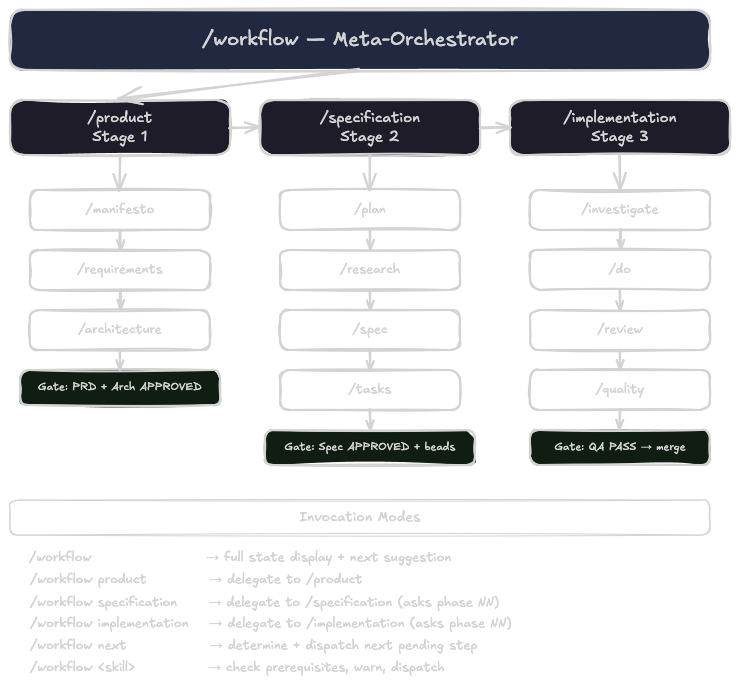
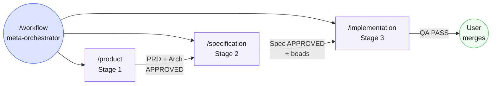
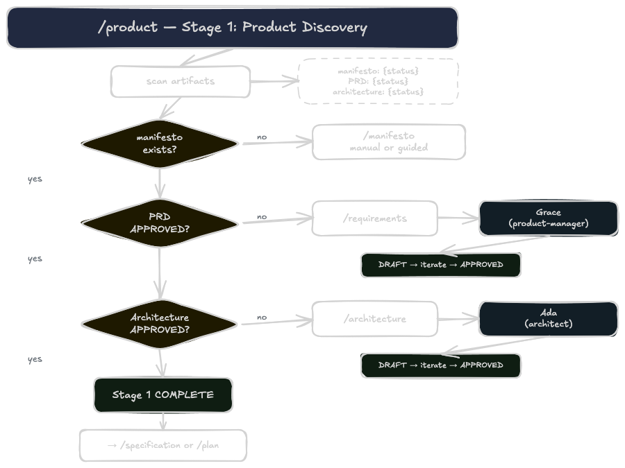
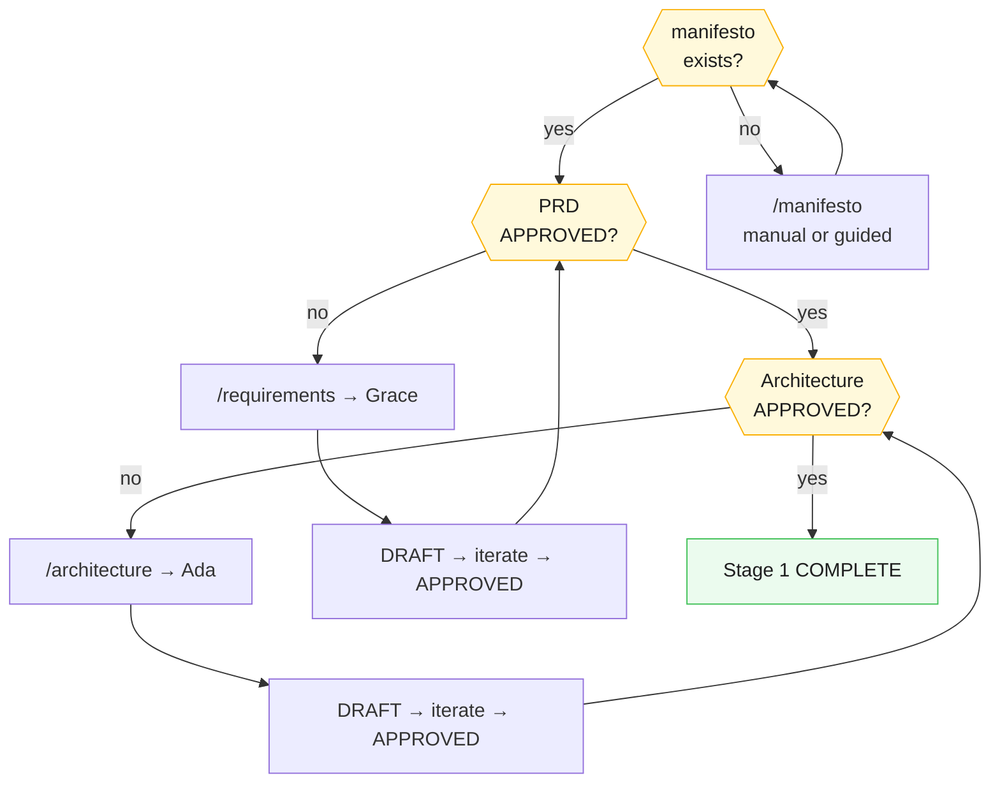
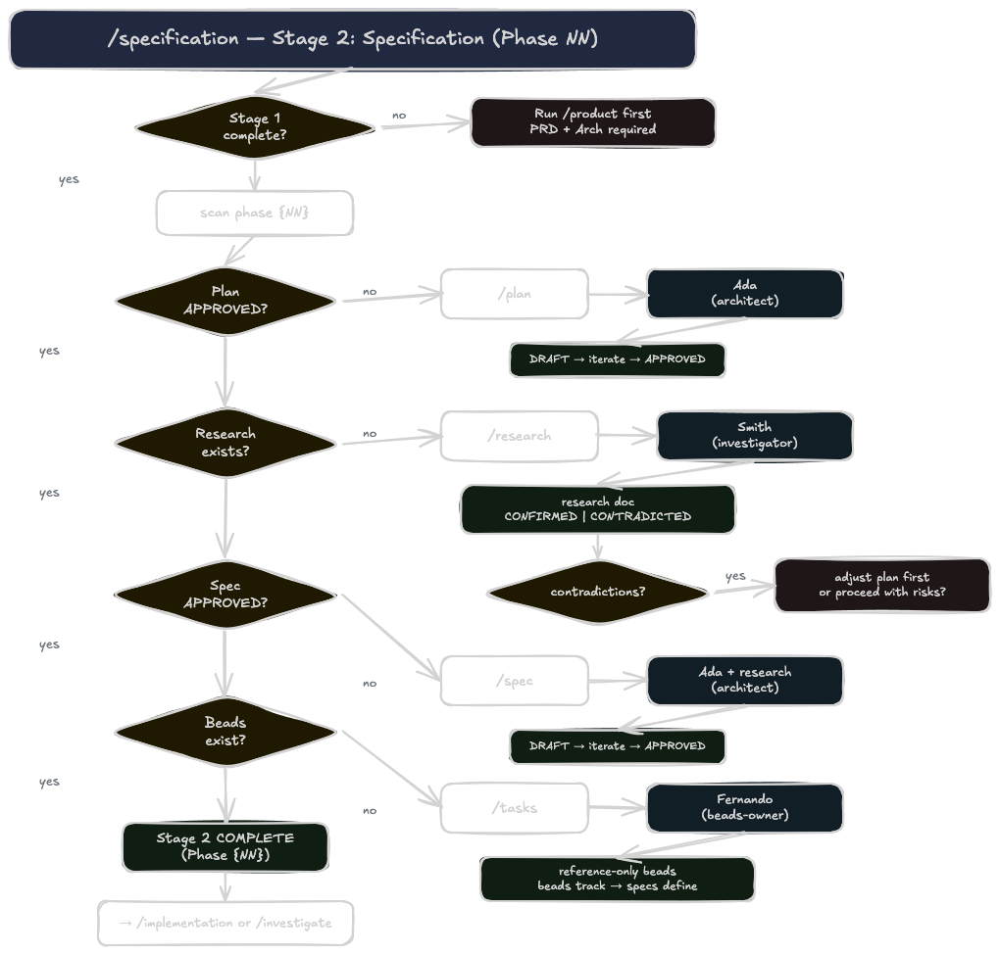
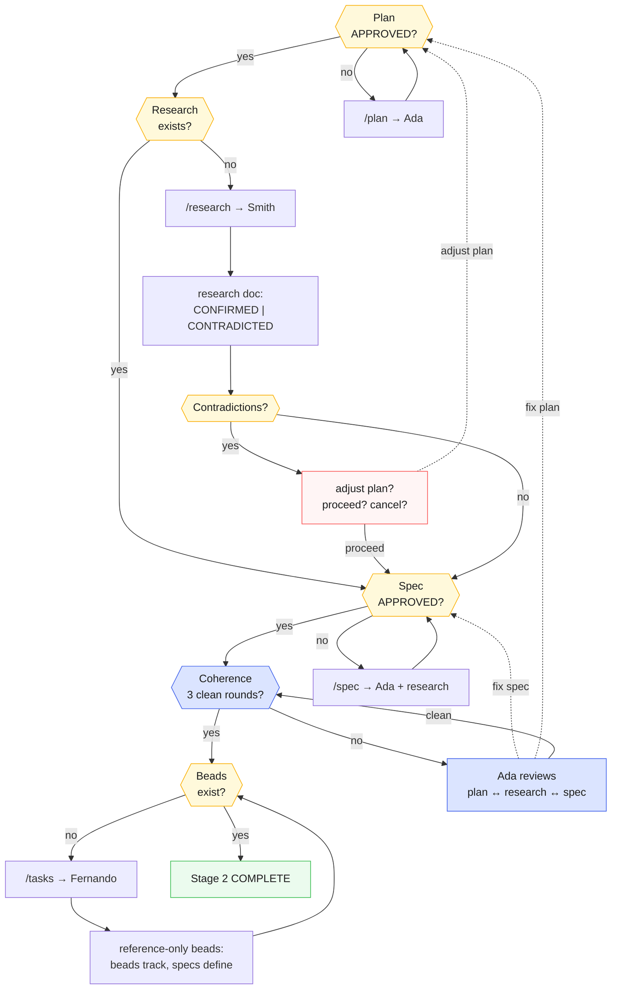
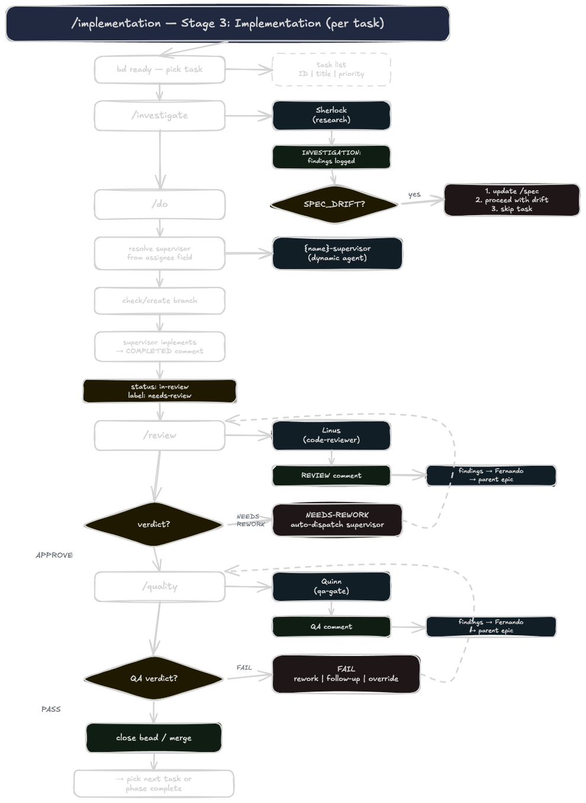
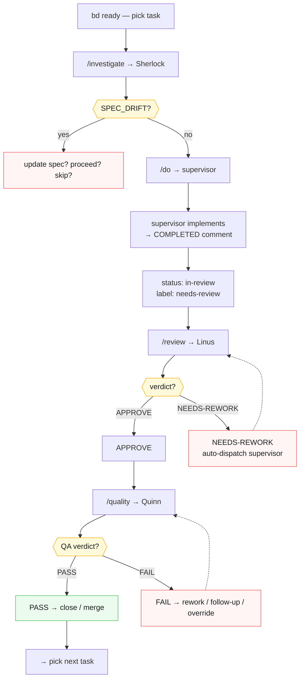
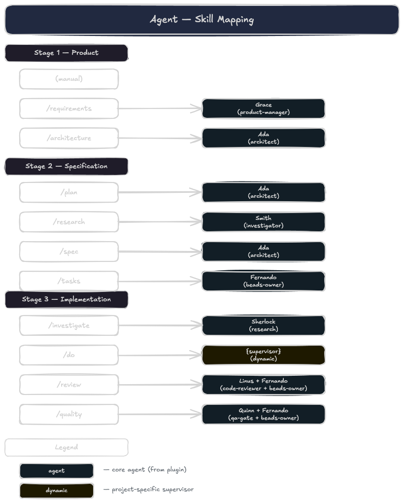
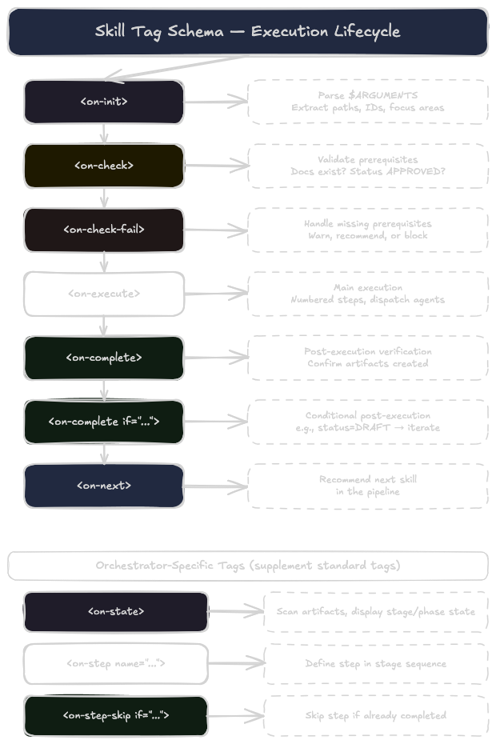

# mister-anderson

A Claude Code plugin for methodical, human-controlled software development with [beads](https://github.com/steveyegge/beads) task tracking.

> Follow the white rabbit, Neo.

## What This Plugin Does

mister-anderson turns Claude Code into a **3-stage development pipeline** where you stay in control at every gate. Ideas go through product discovery, get validated by research before specs are written, and every implementation is investigated, reviewed, and QA-validated before merge.

This is not multi-agent vibe coding. This is:

- **3-stage pipeline** — Product Discovery → Specification → Implementation
- **Research before spec** — technical assumptions are validated against real APIs and code before the spec is written
- **Reference-only beads** — tasks point to specs, they don't summarize them (no lossy compression)
- **Investigation before implementation** — Sherlock analyzes the codebase before the supervisor codes
- **Two quality gates** — code review (Linus) then QA (Quinn), with auto-rework loops
- **Full traceability** — structured comment trails on every bead, decisions and deviations logged
- **You merge** — nothing ships without your explicit approval

## Requirements

- [Claude Code](https://claude.com/claude-code)
- [beads CLI](https://github.com/steveyegge/beads) >= 0.60 (`bd` command)
- [Dolt](https://github.com/dolthub/dolt) sql-server running (port 3307 or 3306) — required by beads

## Installation

```bash
# 1. Add the marketplace
/plugin marketplace add websublime/mister-anderson

# 2. Install the plugin
/plugin install mister-anderson@websublime-mister-anderson

# 3. Bootstrap your project
/setup
```

---

## The Pipeline



The pipeline has 3 stages, each with an orchestrator skill that sequences the atomic skills:



| Stage | Orchestrator | Atoms | Gate |
|-------|-------------|-------|------|
| **1 — Product Discovery** | `/product` | `/manifesto` → `/requirements` → `/architecture` | PRD APPROVED + Architecture APPROVED |
| **2 — Specification** | `/specification` | `/plan` → `/research` → `/spec` → coherence review → `/tasks` | Spec APPROVED + 3 clean coherence rounds + beads created |
| **3 — Implementation** | `/implementation` | `/investigate` → `/do` → `/review` → `/quality` | QA PASS → merge |

**Meta-orchestrator:** `/workflow` shows project state across all stages, suggests the next step, and routes to the correct stage orchestrator.

---

## Stage 1 — Product Discovery



One-shot per project. Define what to build and how to build it at a high level.



### /manifesto

Create the product vision, principles, and governing laws. This is typically a manual step — you write it directly or use guided prompts.

- **Output:** `docs/MANIFESTO.md`
- **Status:** Optional but recommended — downstream documents align with manifesto principles

### /requirements

Transform a raw idea into a structured Product Requirements Document (PRD).

- **Agent:** Grace (product-manager)
- **Output:** `docs/prd/PRD-{name}.md` with status DRAFT → APPROVED
- **What happens:**
  1. Grace conducts a discovery interview — structured questions to extract requirements
  2. Applies product frameworks (JTBD, RICE/Kano) to structure the PRD
  3. Writes to file with status DRAFT
  4. You review and iterate until satisfied → status becomes APPROVED

### /architecture

Create high-level product architecture — system design, tech stack, structural decisions.

- **Agent:** Ada (architect)
- **Requires:** PRD APPROVED
- **Output:** `docs/ARCHITECTURE.md` with status DRAFT → APPROVED
- **What happens:**
  1. Ada reads the PRD, analyzes the codebase, researches patterns and dependencies
  2. Produces architecture with design decisions, data models, API contracts
  3. You iterate until APPROVED

**Gate:** Stage 1 is complete when both PRD and Architecture are APPROVED. Proceed to Stage 2.

---

## Stage 2 — Specification



Repeatable per phase/feature. Plan the phase, validate assumptions with research, write the spec, verify coherence, create tasks.



### /plan

Create a phase plan that scopes work, defines high-level tasks, and identifies dependencies.

- **Agent:** Ada (architect)
- **Requires:** PRD APPROVED + Architecture APPROVED
- **Output:** `docs/plans/NN-plan-{feature}.md` with status DRAFT → APPROVED
- **Key:** This is a **planning document** — scope, task breakdown, dependencies. Not a spec.

### /research

Validate technical assumptions from the plan against real APIs, libraries, and codebase.

- **Agent:** Smith (investigator)
- **Requires:** Plan APPROVED
- **Output:** `docs/research/NN-research-{topic}.md`
- **What happens:**
  1. Smith reads the plan and extracts all external dependencies and technical assumptions
  2. Investigates each using official docs (context7), GitHub examples, WebFetch, and codebase analysis
  3. Classifies each assumption: **CONFIRMED**, **CONTRADICTED**, or **PARTIALLY CONFIRMED** with evidence
  4. Documents contradictions with plan-vs-reality comparison and recommendations
  5. If contradictions found, you decide: **adjust the plan** (recommended — loops back to `/plan`, then re-research until coherent) or proceed with known risks

**Why this step exists:** Without research, specs are based on assumptions. When supervisors hit reality during implementation, they discover mismatches and create new tasks — this is the root cause of task drift.

**Plan↔Research loop:** When you choose "adjust the plan", the `/specification` orchestrator routes back to `/plan` for Ada to correct, then re-runs `/research` to validate corrections. This loop repeats until zero contradictions or you explicitly accept the risks.

### /spec

Create a detailed technical specification grounded in validated research.

- **Agent:** Ada (architect)
- **Requires:** Plan APPROVED + Research docs (warns if missing)
- **Output:** `docs/specs/NN-spec-{feature}.md` with status DRAFT → APPROVED
- **Key:** Ada reads the research docs first and designs around verified facts, not assumptions. If research contradicted a plan assumption, the spec follows reality, not the plan.

### Coherence Review

Cross-document validation gate before task creation. Ensures plan, research, and spec are fully aligned.

- **Agent:** Ada (architect) — read-only review mode
- **Requires:** Spec APPROVED
- **Minimum:** 3 clean review rounds before proceeding to `/tasks`
- **What happens:**
  1. Ada reads plan + research + spec together and cross-checks for discrepancies
  2. Each round focuses on a different aspect:
     - **Round 1:** Structural coherence — scope coverage, missing requirements
     - **Round 2:** Technical coherence — API contracts, data models, dependency assumptions
     - **Round 3:** Acceptance coherence — criteria traceability from PRD → plan → spec
  3. If discrepancies found: fix in spec (route to `/spec`) or fix in plan (route back to plan↔research loop), then reset round counter
  4. If clean: increment counter. After 3 clean rounds → proceed to `/tasks`

**Why this gate exists:** A spec can be individually "correct" but drift from the plan or ignore research findings. Three rounds of cross-document review catch subtle misalignments before they become task drift during implementation.

### /tasks

Decompose a spec into trackable epics and issues.

- **Agent:** Fernando (beads-owner)
- **Requires:** Spec APPROVED + Coherence review passed (3 clean rounds) + PRD
- **Output:** Beads (epics + issues) in the beads database
- **Two modes:**
  - **Full decomposition** — from a spec: creates epics and issues with reference-only fields
  - **Ad-hoc** — from user input: creates individual issues without requiring a spec

**Reference-only beads — critical design decision:**

Beads are tracking artifacts that **point to** specs — they are not specs themselves.

| Field | Contains | Does NOT contain |
|-------|----------|-----------------|
| `--design` | `See spec.md § Section 3` | Copied spec content |
| `--external-ref` | `SPEC §7.4 \| PLAN task 06.03` | Summarized requirements |
| `--acceptance` | `API returns paginated results` | `Use Prisma cursor-based pagination` |
| `--description` | Why this task exists | How to implement it |

**Why:** Each summarization step loses nuance. When supervisors treat the bead as source of truth instead of reading the actual spec, implementation gaps emerge — the root cause of task drift.

**Gate:** Stage 2 is complete when the spec is APPROVED, coherence review passes (3 clean rounds), and beads are created. Proceed to Stage 3.

---

## Stage 3 — Implementation



Repeatable per task. Investigate, implement, review, QA — with rework loops.



### /investigate

Run codebase investigation on a bead task before implementation.

- **Agent:** Sherlock (research)
- **Input:** Bead ID (or picks from `bd ready`)
- **What happens:**
  1. Reads full bead context — description, acceptance criteria, design notes, epic design doc
  2. Dispatches Sherlock to trace code paths, identify root cause, map affected files
  3. Sherlock spot-checks the spec's Research Findings against the current codebase
  4. If **SPEC_DRIFT** detected, you decide: update the spec, proceed with known drift, or skip the task
  5. Findings logged as structured `INVESTIGATION:` comment on the bead

### /do

Dispatch the implementation supervisor for a bead task.

- **Agent:** Dynamic supervisor (from `assignee` field)
- **Requires:** Bead exists (investigation recommended but not required)
- **What happens:**
  1. Reads the `assignee` field to resolve the correct supervisor (e.g., `rust-supervisor`)
  2. If supervisor not found, lists available supervisors or suggests `/add-supervisor`
  3. Checks for existing branch (from previous rework cycle) — asks to continue or create fresh
  4. Dispatches the supervisor with full context
  5. The PreToolUse hook automatically injects engineering discipline (Rules 0-5)

**The supervisor then:**
- Creates branch `feature/{task-id-kebab-case}` from the specified base branch
- Marks bead `in_progress`
- Implements with frequent commits
- Logs `DECISION:` and `DEVIATION:` comments for non-trivial choices
- Logs a `COMPLETED:` comment summarizing what was done
- Pushes, adds `needs-review` label, marks bead `in-review`

### /review

Code review gate — dispatches Linus to analyze the implementation branch.

- **Agent:** Linus (code-reviewer) + Fernando (beads-owner) for findings tracking
- **Requires:** Bead with `needs-review` label
- **What happens:**
  1. Linus analyzes the branch diff against acceptance criteria
  2. Each finding gets a severity: `CRITICAL`, `WARNING`, `SUGGESTION`, `GOOD`
  3. Logs a structured `REVIEW:` comment with verdict

**If APPROVE:**
- Labels: `needs-review` → `approved`
- All non-`[GOOD]` findings tracked as issues in the parent epic
- Ready for QA

**If NEEDS-REWORK:**
- Labels: `needs-review` → `needs-rework`, status → `in_progress`
- `SUGGESTION` findings tracked as separate issues (out of scope for rework)
- Auto-dispatches the implementation supervisor with `y/n` confirmation
- Supervisor reads the REVIEW comment to know exactly what to fix (CRITICAL + WARNING)
- After rework, the task returns to `/review`

**Escape hatch:** Answer `n` to the dispatch confirmation. Labels are already set — resume later with `/do`.

### /quality

QA finalization gate — last gate before merge.

- **Agent:** Quinn (qa-gate) + Fernando (beads-owner) for findings tracking
- **Requires:** Bead with `approved` label (passed code review)
- **What happens:**
  1. Quinn validates: spec conformity, user stories, boundary/edge cases, decision trail audit
  2. Runs: tests, build, lint, functional verification
  3. Verdict: `PASS` or `FAIL` with severity (BLOCKER/MAJOR/MINOR)

**If PASS:**
- Label `qa-passed` added
- You close the bead and merge

**If FAIL:**
- You decide: **rework** (auto-dispatches supervisor), **follow-up** (create new bead for gaps), or **override** (merge anyway)
- Non-scope findings (MINOR, EXTRA, RISK) tracked as separate issues
- Rework loops back to `/quality` after the supervisor finishes

**Gate:** QA PASS means the task is ready for merge. You create the PR and merge when satisfied.

---

## Orchestrators

Orchestrators sequence the atomic skills within a stage. They scan for existing artifacts, skip completed steps, and dispatch sub-skills in order.

### /product

Stage 1 orchestrator. Walks through manifesto → requirements → architecture, skipping completed steps.

```
/product           # guided flow through Stage 1
/product status    # show Stage 1 state only
```

### /specification

Stage 2 orchestrator. Walks through plan → research → spec → tasks for a specific phase.

```
/specification 01     # guided flow for Phase 01
/specification status # show all phase states
```

### /implementation

Stage 3 orchestrator. Shows task progress, picks a task, and routes through investigate → do → review → quality.

```
/implementation 01       # guided flow for Phase 01 tasks
/implementation bd-001.2 # jump to a specific task
```

### /workflow

Meta-orchestrator across all stages. Shows full project state, suggests the next step, and routes to stage orchestrators or individual skills.

```
/workflow                  # full state display + next suggestion
/workflow product          # delegate to /product
/workflow specification 01 # delegate to /specification for Phase 01
/workflow implementation   # delegate to /implementation (asks phase NN)
/workflow next             # determine + dispatch next pending step
/workflow spec             # jump to /spec with prerequisite warnings
```

When suggesting the next step, `/workflow` presents both options:
```
Next step: Research (Phase 01)
  Guided:  /specification 01  — walks through remaining steps
  Direct:  /research          — jump straight to research
```

**Jump warnings:** If you request a step with unmet prerequisites, `/workflow` warns but does not block:
```
Warning: You are about to run /spec but the following prerequisites are missing:
  - Research: no docs found in docs/research/01-*

Without validated research, the spec will be based on unvalidated assumptions.
This historically causes task drift during implementation.

Do you want to:
  1. Run /research first (recommended)
  2. Proceed to /spec anyway
  3. Cancel
```

---

## Agents



### Core Agents

| Agent | Persona | Role | Dispatched by |
|-------|---------|------|---------------|
| `product-manager.md` | **Grace** | Requirements elicitation, PRD creation | `/requirements` |
| `architect.md` | **Ada** | System design, specs, plans | `/architecture`, `/plan`, `/spec` |
| `investigator.md` | **Smith** | Feasibility research, assumption validation | `/research` |
| `research.md` | **Sherlock** | Codebase investigation, root cause analysis | `/investigate` |
| `code-reviewer.md` | **Linus** | Code review gate, structured review reports | `/review` |
| `qa-gate.md` | **Quinn** | QA finalization: spec conformity, tests, build, lint | `/quality` |
| `beads-owner.md` | **Fernando** | Product owner, creates epics and issues | `/tasks`, `/review` (findings), `/quality` (findings) |
| `discovery.md` | **Daphne** | Supervisor factory: detects tech stack, creates supervisors | `/setup`, `/add-supervisor` |

### Dynamic Supervisors

Created by Daphne (Discovery) based on your tech stack. Each gets the `-supervisor` suffix which triggers the discipline hook.

| Technology | Supervisor | Persona |
|------------|-----------|---------|
| Rust | `rust-supervisor` | Neo |
| Node.js (Express/Fastify/NestJS) | `node-backend-supervisor` | Nina |
| React/Next.js | `react-supervisor` | Luna |
| Vue/Nuxt | `vue-supervisor` | Violet |
| Python (FastAPI/Django/Flask) | `python-backend-supervisor` | Tessa |
| Go | `go-supervisor` | Greta |
| Docker/CI/Terraform | `infra-supervisor` | Olive |
| Flutter | `flutter-supervisor` | Maya |
| iOS/Android/Blockchain/ML | See `/add-supervisor` | — |

Need one that doesn't exist? Run `/add-supervisor {tech}`.

### Agent Classification

| Category | Writes code? | Writes docs? | Creates beads? | Discipline hook? |
|----------|:----------:|:----------:|:------------:|:--------------:|
| **Document advisors** (Grace, Ada) | No | Yes | No | No |
| **Investigators** (Smith, Sherlock) | No | Smith: Yes (research docs), Sherlock: No (bead comments only) | No | No |
| **Quality gates** (Linus, Quinn) | No | No | No | No |
| **Task creator** (Fernando) | No | No | Yes | No |
| **Factory** (Daphne) | Agent files only | No | No | No |
| **Supervisors** (`*-supervisor`) | Yes | No | No | **Yes** |

The `-supervisor` suffix is the trigger — the PreToolUse hook injects engineering discipline whenever a supervisor is dispatched.

---

## Discipline & Comment Trail

### Supervisor Rules

All implementation supervisors follow 8 mandatory rules, auto-injected by the discipline hook:

| Rule | Principle |
|------|-----------|
| **Rule 0** | Follow instructions exactly — no unilateral decisions |
| **Rule 0.1** | Read the bead first — comments contain investigation findings and dispatch context |
| **Rule 1** | Look at actual data before coding against it |
| **Rule 2** | Test functionally — close the loop |
| **Rule 3** | Use available tools to verify |
| **Rule 4** | Log decisions (`DECISION:`) and deviations from spec (`DEVIATION:`) as bead comments |
| **Rule 5** | Log `COMPLETED:` comment and record `impl=done` state — enforced by SubagentStop hook |
| **Rule 6** | Never close beads — your job ends at `in-review` |

### Comment Trail

Every bead accumulates a structured history:

```
INVESTIGATION: (Sherlock)    — what was found in the codebase before implementation
DECISION:      (supervisor)  — non-trivial implementation choices and reasoning
DEVIATION:     (supervisor)  — where implementation differs from spec and why
COMPLETED:     (supervisor)  — what was implemented, files changed, tests run
REVIEW:        (Linus)       — code quality findings with severities and verdict
QA:            (Quinn)       — spec conformity, tests, build, lint, final verdict
```

This trail survives session restarts and context compaction. Any agent or human can reconstruct full context:

```bash
bd comments bd-001.2
```

### State Dimensions & Enforcement

Alongside the comment trail, each gate records a typed **state dimension** on the bead that serves as the canonical proof the gate closed. The comment is the detailed artifact (human-readable); the state is the typed signal (machine-readable, no text parsing). The orchestrator queries state, not comments, to route next steps.

| Dimension | Set by | Values |
|-----------|--------|--------|
| `impl`    | supervisors (`*-supervisor`) | `done` |
| `review`  | `code-reviewer` (Linus)      | `approve` / `needs-rework` |
| `qa`      | `qa-gate` (Quinn)            | `pass` / `fail` |

```bash
bd set-state bd-042 review=approve --reason "Review logged"
bd state bd-042 review   # → approve
```

**Enforcement.** Each enforced agent has `hooks:` in its frontmatter. A paired `PreToolUse`/`Stop` pair (see [Hooks](#hooks)) captures the bead ID from the first `bd show` call and, on exit, verifies the state dimension was set. If the agent finishes without calling `bd set-state`, the `Stop` hook exits with code 2 and a structured enforcement-failure message for the orchestrator — blocking the workflow rather than silently completing a gate that was never closed.

### Findings Tracking

When `/review` or `/quality` produce findings that won't be addressed in the current cycle, Fernando automatically creates tracked issues:

1. Each finding is checked against existing open tasks (deduplication)
2. If already covered → links back with comment + `discovered-from` dependency
3. If new → creates issue under the **parent epic** with `finding:{severity}` label
4. Standalone tasks (no parent) fall back to a "Review Findings" epic

---

## Skill Tag Schema



Every skill follows a standardized tag schema for consistent structure:

### Atomic Skill Tags

| Tag | Purpose | Example |
|-----|---------|---------|
| `<on-init>` | Parse arguments from user input | Extract bead ID, paths, focus areas |
| `<on-check>` | Validate prerequisites | Docs exist? Status APPROVED? |
| `<on-check-fail if="X">` | Handle missing prerequisite X | Recommend earlier skill, warn, or block |
| `<on-execute>` | Main execution — numbered steps, agent dispatch | Locate docs, dispatch Ada, wait for result |
| `<on-complete>` | Post-execution verification | Confirm artifact created, show status |
| `<on-complete if="condition">` | Conditional post-execution | `if="status=DRAFT"` → inform user can iterate |
| `<on-next>` | Recommend the next skill in the pipeline | "Proceed with `/spec`" |

### Orchestrator Tags

| Tag | Purpose |
|-----|---------|
| `<on-state>` | Scan artifacts, display stage/phase state |
| `<on-step name="X">` | Define what happens at step X in the sequence |
| `<on-step-skip if="X_done">` | Skip step X if already completed |

---

## Infrastructure Skills

### /setup

One-time project bootstrap. Initializes beads, detects tech stack, creates supervisors.

```
/setup
```

**What happens:**
1. Checks beads CLI and Dolt server are available
2. Initializes beads (`bd init`) if not already done
3. Detects if bootstrap was previously completed (idempotent)
4. Gets project info and detects tech stack
5. Creates `CLAUDE.md` and `AGENTS.md` from templates with project info
6. Dispatches Daphne to create tech-specific supervisors in `.claude/agents/`
7. Writes version file for update detection
8. Cleans up legacy local copies (from pre-0.1.0 versions) if found

### /update

Update the plugin and clean up legacy local copies.

```
/update
```

**What happens:**
1. Compares installed version with latest remote version
2. Detects legacy local copies (skills, hooks, core agents from older versions)
3. Removes legacy copies after user confirmation — dynamic supervisors are never touched
4. Optionally re-runs Discovery to refresh supervisor templates
5. Reminds to update the Claude Code plugin cache and restart

**What the plugin provides** (no local copy needed): skills, core agents, hooks.
**What stays local** (never touched): CLAUDE.md, AGENTS.md, dynamic supervisors, .beads/, settings.

### /add-supervisor

Create a new supervisor for a technology not yet covered.

```
/add-supervisor rust
```

**What happens:**
1. Checks if a supervisor already exists for the technology
2. Dispatches Daphne in on-demand mode — creates only the requested supervisor
3. Updates the Supervisors section in CLAUDE.md

---

## Hooks

Two hook tiers run in the plugin: **global hooks** declared in `hooks/hooks.json` (apply to every session) and **per-agent hooks** declared in the `hooks:` frontmatter of enforced agents (scoped to that agent's lifecycle, auto-attach only when the agent runs as a subagent).

### Global (hooks.json)

| Hook | Trigger | Purpose |
|------|---------|---------|
| `inject-discipline-reminder.sh` | `PreToolUse` (Agent tool, `*-supervisor` matcher) | Reminds supervisors to invoke the discipline skill at start |
| `session-start.sh` | `SessionStart` | Shows task dashboard: in-progress, ready, blocked, stale, labeled beads. Checks for plugin updates |

### Per-agent (frontmatter `hooks:`)

Attached to `code-reviewer`, `qa-gate`, and every `*-supervisor` (injected by `discovery.md` into each generated supervisor):

| Hook | Trigger | Purpose |
|------|---------|---------|
| `stamp-pending.sh` | `PreToolUse` (Bash) | On the subagent's first `bd show <id>`, captures the bead ID into `bd kv` keyed by the subagent's `agent_id`. Idempotent |
| `verify-state.sh` | `Stop` (auto-converted to `SubagentStop`) | Reads the pending entry, queries `bd state <bead> <dim>`. Missing state → `exit 2` with enforcement-failure message. Dimension is `impl` / `review` / `qa` per agent type |

See [State Dimensions & Enforcement](#state-dimensions--enforcement) for the full mechanism.

---

## Project Structure

```
mister-anderson/
|-- .claude-plugin/
|   +-- plugin.json              # Plugin manifest
|-- agents/
|   |-- product-manager.md       # Grace — requirements elicitation
|   |-- architect.md             # Ada — system design, specs, plans
|   |-- investigator.md          # Smith — feasibility research
|   |-- research.md              # Sherlock — codebase investigation
|   |-- code-reviewer.md         # Linus — code review gate
|   |-- qa-gate.md               # Quinn — QA finalization gate
|   |-- beads-owner.md           # Fernando — product owner
|   +-- discovery.md             # Daphne — supervisor factory
|-- docs/
|   +-- diagrams/                # Excalidraw sources + PNG exports
|-- hooks/
|   |-- hooks.json               # Global hook configuration
|   |-- inject-discipline-reminder.sh  # Global: supervisor dispatch reminder
|   |-- session-start.sh               # Global: task dashboard on session start
|   |-- stamp-pending.sh               # Per-agent: capture bead ID into bd kv
|   +-- verify-state.sh                # Per-agent: enforce state dimension on Stop
|-- skills/
|   |-- manifesto/               # Stage 1: product vision
|   |-- requirements/            # Stage 1: PRD creation (Grace)
|   |-- architecture/            # Stage 1: system design (Ada)
|   |-- plan/                    # Stage 2: phase planning (Ada)
|   |-- research/                # Stage 2: assumption validation (Smith)
|   |-- spec/                    # Stage 2: technical spec (Ada)
|   |-- tasks/                   # Stage 2: bead creation (Fernando)
|   |-- investigate/             # Stage 3: codebase investigation (Sherlock)
|   |-- do/                      # Stage 3: supervisor dispatch
|   |-- review/                  # Stage 3: code review (Linus)
|   |-- quality/                 # Stage 3: QA validation (Quinn)
|   |-- product/                 # Orchestrator: Stage 1
|   |-- specification/           # Orchestrator: Stage 2
|   |-- implementation/          # Orchestrator: Stage 3
|   |-- workflow/                # Meta-orchestrator
|   |-- setup/                   # Infrastructure: project bootstrap
|   |   +-- templates/           # CLAUDE.md, AGENTS.md, BEADS-WORKFLOW.md
|   |-- update/                  # Infrastructure: plugin update
|   |-- add-supervisor/          # Infrastructure: create supervisor
|   +-- subagents-discipline/    # Internal: engineering rules (auto-injected)
|-- LICENSE
+-- README.md
```

---

## Quick Start

```bash
# Stage 1 — Product Discovery (one-shot)
/setup                    # bootstrap project
/workflow                 # see project state

/manifesto                # define product vision (optional)
/requirements             # create PRD with Grace → APPROVED
/architecture             # design architecture with Ada → APPROVED

# Stage 2 — Specification (per phase)
/plan                     # plan phase scope with Ada → APPROVED
/research                 # validate assumptions with Smith
/spec                     # write spec with Ada + research → APPROVED
/tasks                    # create beads from spec with Fernando

# Stage 3 — Implementation (per task)
/investigate              # Sherlock investigates the codebase
/do                       # dispatch supervisor to implement
/review                   # Linus reviews the code
/quality                  # Quinn validates spec conformity + tests
# → merge when satisfied

# Or use orchestrators for guided flow:
/product                  # guided Stage 1
/specification 01         # guided Stage 2 for Phase 01
/implementation 01        # guided Stage 3 for Phase 01
/workflow next            # auto-detect and suggest next step
```

---

## All Skills Reference

### Stage 1 — Product Discovery

| Skill | Command | Agent | Purpose |
|-------|---------|-------|---------|
| manifesto | `/manifesto` | — | Product vision, principles, governing laws |
| requirements | `/requirements` | Grace | PRD from raw idea |
| architecture | `/architecture` | Ada | High-level system design |

### Stage 2 — Specification

| Skill | Command | Agent | Purpose |
|-------|---------|-------|---------|
| plan | `/plan` | Ada | Phase scope, task breakdown, dependencies |
| research | `/research` | Smith | Validate plan assumptions against reality |
| spec | `/spec` | Ada | Technical spec grounded in research |
| tasks | `/tasks` | Fernando | Decompose spec into beads (or ad-hoc issues) |

### Stage 3 — Implementation

| Skill | Command | Agent | Purpose |
|-------|---------|-------|---------|
| investigate | `/investigate [bead-id]` | Sherlock | Codebase investigation + spec drift detection |
| do | `/do [bead-id]` | {supervisor} | Resolve supervisor, manage branch, dispatch |
| review | `/review [bead-id]` | Linus + Fernando | Code review gate + findings tracking |
| quality | `/quality [bead-id]` | Quinn + Fernando | QA gate + findings tracking |

### Orchestrators

| Skill | Command | Purpose |
|-------|---------|---------|
| product | `/product` | Stage 1 guided flow |
| specification | `/specification [phase]` | Stage 2 guided flow |
| implementation | `/implementation [phase\|bead-id]` | Stage 3 guided flow |
| workflow | `/workflow [product\|specification\|implementation\|next\|skill]` | Meta-orchestrator, project state |

### Infrastructure

| Skill | Command | Purpose |
|-------|---------|---------|
| setup | `/setup` | One-time project bootstrap |
| update | `/update` | Plugin update + legacy cleanup |
| add-supervisor | `/add-supervisor [tech]` | Create supervisor for a new technology |

### Internal

| Skill | Purpose |
|-------|---------|
| subagents-discipline | Engineering rules auto-injected into supervisors (Rules 0-6) |

---

## FAQ

**Q: Do I need to run all 3 stages in order?**
A: Stage 1 is one-shot. After that, you can jump to any skill — `/workflow` will warn about missing prerequisites but won't block you. Use orchestrators for guided flow or individual skills for quick jumps.

**Q: What if I already have a PRD and spec from elsewhere?**
A: Place them in the expected paths (`docs/prd/`, `docs/specs/`) with `Status: APPROVED` in the frontmatter. `/workflow` will detect them and skip those steps.

**Q: Why research before spec? Isn't that overkill?**
A: Without research, Ada writes specs based on plan assumptions. When supervisors hit reality (wrong API field names, missing endpoints, version-specific behavior), they create ad-hoc tasks — this is task drift. Research catches these before the spec is written.

**Q: Why are beads "reference-only"?**
A: Each summarization step loses nuance. When beads contain copied spec content, supervisors treat the bead as the source of truth instead of reading the actual spec. Implementation gaps emerge. Beads point to specs — they don't replace them.

**Q: What happens if a supervisor doesn't exist for my task?**
A: `/do` checks the `assignee` field, lists available supervisors, and suggests `/add-supervisor {tech}` if none match. Discovery creates the supervisor from an external template directory.

**Q: Can I skip investigation and go straight to implementation?**
A: Yes. `/do` warns that no investigation exists but lets you proceed. Investigation is recommended but not required.

**Q: How do rework loops work?**
A: When `/review` returns NEEDS-REWORK or `/quality` returns FAIL, the skill auto-dispatches the original supervisor (from the bead's `assignee`) in the same session after `y/n` confirmation. The supervisor reads the REVIEW/QA comment to know what to fix. After rework, the task returns to the same gate.

**Q: Who merges?**
A: You do. mister-anderson never merges. After QA PASS, you create a PR, review it yourself, and merge when satisfied.

---

## Beads Compatibility

This plugin is tested with **beads >= 0.60** (Dolt backend).

| Command | Current (beads 0.60+) |
|---------|-----------------------|
| Init | `bd init` |
| Add comment | `bd comments add {ID} "text"` |
| Add label | `bd label add {ID} {label}` |
| Remove label | `bd label remove {ID} {label}` |
| Sync | `bd dolt push` / `bd dolt pull` (remote only — skip for localhost) |
| Storage | Dolt (MySQL protocol) |

---

## License

MIT
